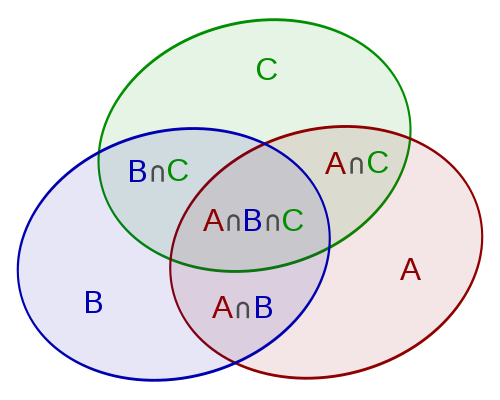

```{r setup, include=FALSE}
knitr::opts_chunk$set(echo = TRUE)
library(tidyverse)
```

# Aufgabe 04 Mit Zettel und Bleistift - Wahrscheinlichkeiten
Grundlagen aus [@Hedderich.2018]

a)Verallgemeinern Sie den Additionssatz
${P}(A\cup B) = {P}(A) + {P}(B) - {P}(A\cap B)$
für drei einander nicht ausschließende Ereignisse ${P}(A \cup B \cup C)$.
```{r}

#Additionssatz für vereinbare Ereignisse
```

${P}(A \cup B \cup C) = {P}(A) + {P}(B) + {P}(C) - {P}(A \cap B) - {P}(A \cap C) - {P}(B \cap C) + {P}(A \cap B \cap C)$

b) Bedingte Wahrscheinlichkeiten:
Bestimmen Sie die Eintrittswahrscheinlichkeit von Ereignis A unter der Bedingung,
dass B bereits eingetreten ist
$P(A|B)$ für die Fälle

- A und B sind unabhängig von einander: 
Dann gilt:\
$$P(A \cap B) = {P}(A) * {P}(B)$$
Daraus folgt:
$$P(A|B)= \frac{P(A\cap B)}{P(B)}=\frac{P(A) * P(B)}{P(B)}=P(A)$$

- A und B schließen einander aus \
A und B haben keine gemeinsame Schnittmenge.
$$P(A|B) = \frac{P(A\cap B)}{P(B)} = \frac{0}{P(B)} = 0$$
Siehe Venn-Diagramme in [@Hedderich.2018] \

c)Multiplikationssatz
$$P(A \cap B \cap C) = P(A) * P(B \mid A) * P(C | A \cap B)$$
Während eines Fußballspiels zweier Mannschaften X und Y, schickt der Schiedsrichter im Abstand von jeweils 5 Minuten zufällig und völlig willkürlich drei Spieler mit der roten Karte vorzeitig vom Platz. 
Wie hoch ist die Wahrscheinlichkeit, dass bloß eine Mannschaft betroffen ist?

- Jede Mannschaft besteht aus 11 Spielern, zu Beginn stehen also 22 Spieler auf dem Feld. Nach der ersten roten Karte 21 Spieler, 20 nach der zweiten etc.
- sind nur Spieler einer Mannschaft betroffen verändert sich das Verhältnis der Mannschaften von 11:11, zu 10:11, zu 9:11, zu 8:11.
- Da es zwei Pfade, je einer für jede Mannschaft, für das Ereignis, dass nur Spieler einer Mannschaft eine rote Karte bekommen, gibt, wird die Pfadwahrscheinlichkeit mit 2 multipliziert.

Daraus folgt:
${P}(Team A \cap Team A \cap Team A) = {P}(11/22) * {P}(10/21) * P(9/20) * 2$

```{r}
P=(11/22)*(10/21)*(9/20)*2
print(P)
```
Die Wahrscheinlichkeit, dass ein Team drei rote Karten in Folge bekommt beträgt ~21.42%

# Aufgabe 05 Der Übungsdatensatz

```{r aufgabe 05}
#Daten laden
data <- read.delim("data/yingtan_20_v1.csv",
                   sep = ";",
                   dec = ",")
```
a) In was für einer Datenstruktur wurde die geladene Datei in R abgelegt?
Wie viele Beobachtungen und Variablen enthält sie? Von welchem Datentyp ist die Variable 'Ca_exch'? 
```{r aufgabe 05a}
#Datenstruktur
str(data)

str(data$Ca_exch)
```
Die geladene Datei wurde als Data Frame angelegt und enthält 337 Beobachtungen sowie neun Variablen. \
Die Variable 'Ca_exch' ist als Typ numeric gespeichert. \

b) Sie haben sich mit dem Aufbau des Datensatzes vertraut gemacht und bemerkt, dass für zwei Standorte keine Messwerte vorliegen. Erstellen Sie ein neues Objekt ljz, in dem diese Proben nicht mehr auftauchen.
```{r aufgabe 05b}
#NA definieren
is.na(data) <- data == -9999
#Entfernung von NA-Werten
ljz <- na.omit(data)
#ljz  -> zeigt die neue Tabelle ohne NA-Werte an
```
c) Beim Transfer der Laborergebnisse in die Messtabelle scheint bei den austauschbaren Na-Ionen ein Missgeschick passiert zu sein. Identifizieren Sie den fehlerhaften Wert und ersetzen Sie ihn durch die in R gängige NoData-Bezeichnung 'NA'. Fallen Ihnen zusätzliche Werte auf, die bei möglichen Rechenoperationen zu Problemen führen könnten? Begründen Sie ihre Wahl und beheben Sie das Problem auf angemessene Weise.
```{r aufgabe 05c}
#Spalte mit Na-Ionen
#ljz$Na_exch
#In Zeile 96 ist ein negativer Wert
#Diesen Wert, bzw. alle Werte < 0, als NA setzen
is.na(ljz[, "Na_exch"]) <- ljz$Na_exch < 0
#Außerdem gibt es in derselben Spalte einige Werte mit einer 0
#Da man nicht durch 0 teilen oder die Wurzel aus 0 berechnen kann,
#kann dies zu Problemen führen
is.na(ljz[, "Na_exch"]) <- ljz$Na_exch == 0
#ljz$Na_exch -> Anzeige der Spaltenwerte mit neuen NA-Werten
```
# Aufgabe 06 Tinn R
a) In R lassen sich Arbeitsschritte prima automatisieren.
Stellen Sie sich vor, ihr Chef, der völlig zu Recht von R begeistert ist, möchte, dass Sie für ein neues Projekt aus dem ursprünglichen Datensatz nur die Standorte der Catena A extrahieren.
Er verlangt von Ihnen ein R-Skript, das außerdem …
b) … die Reihenfolge der Standorte nach abnehmender Ca-Ionenkonzentration sortiert.
c) … das Ergebnis in eine sinnvoll benannte CSV-Datei schreibt. Führen Sie die Schritte 6 a bis c in einer Pipe aus und binden Sie diese in ihr Protokoll ein. Speichern Sie die Pipe zusätzlich als .R-Skript in ihrem Kursordner ab und geben Sie im Protokoll den Befehl an, mit dem es sich in der Konsole ausführen lässt. 
```{r aufgabe 06}
#Aus data Standorte der Catena A
#Reihenfolge nach abnehmender Ca-Ionenkonzentration
#als csv schreiben
library(dplyr)
catA <- dplyr::filter(data, 
                      SAMPLING == "catA") %>%
  arrange(desc(Ca_exch)) %>%
  write.table("data/catA.csv",
              sep = ";",
              dec = ",")
```
Öffnen des RSkripts mit der Funktion:
```{r aufgabe 06c}
source(file = "catA.R")
```
## Literatur